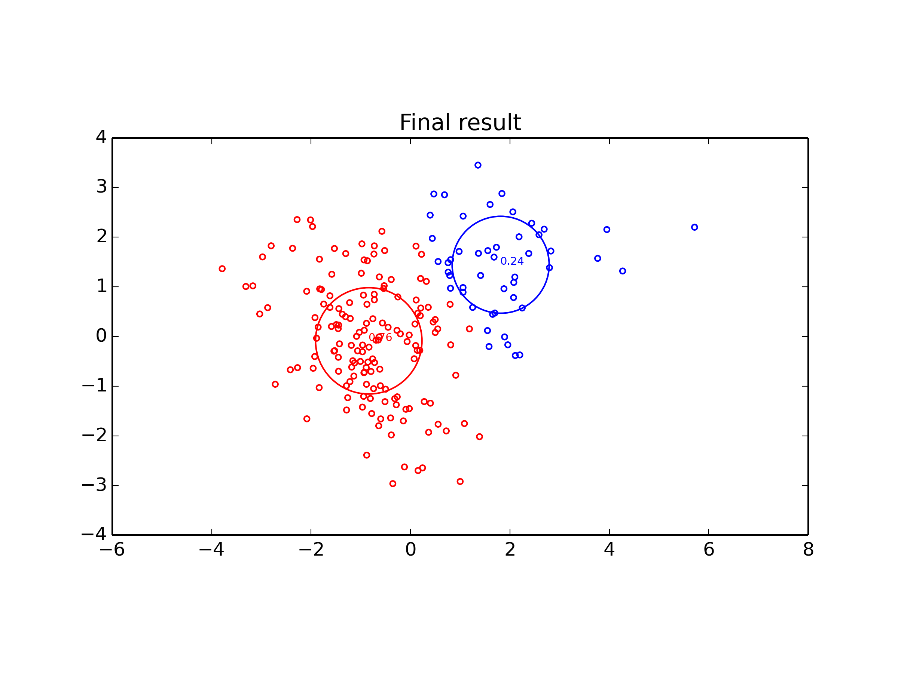
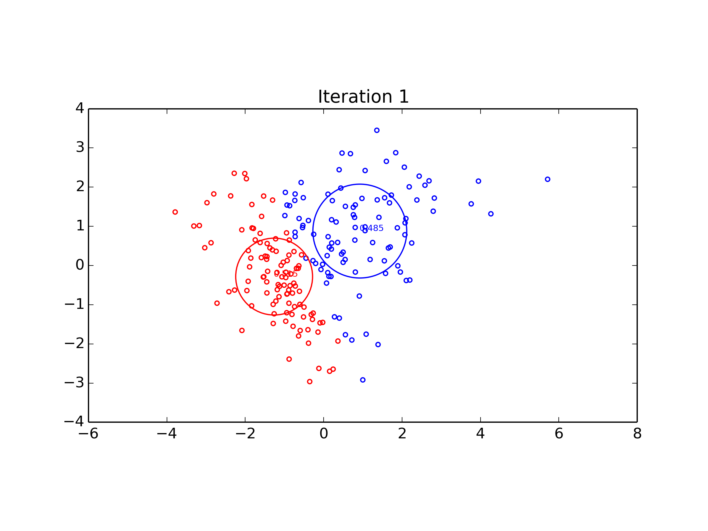
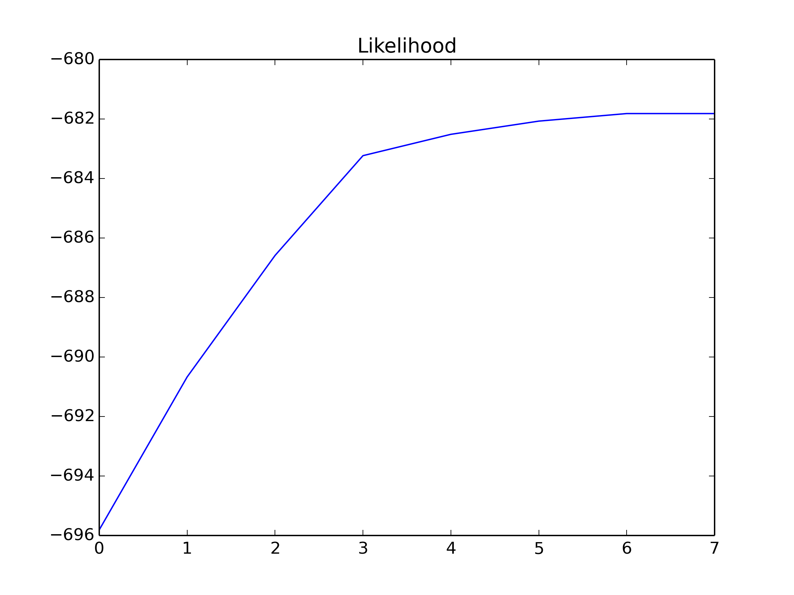

# Mixture of Gaussians & EM
Machine Learning Assignment 3

### Visualization

| Data distribution             | EM result                          |
|:-----------------------------:|:----------------------------------:|
|  |  |

### Evolving of the algorithm
| Cluster evolving               | Likelihood evolving            |
|:-----------------------------:|:-------------------------------:|
| | |
